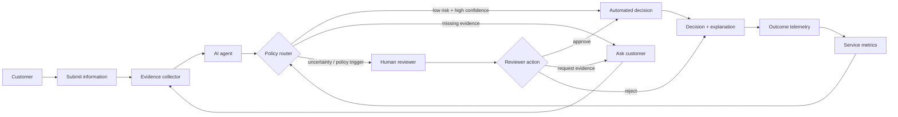
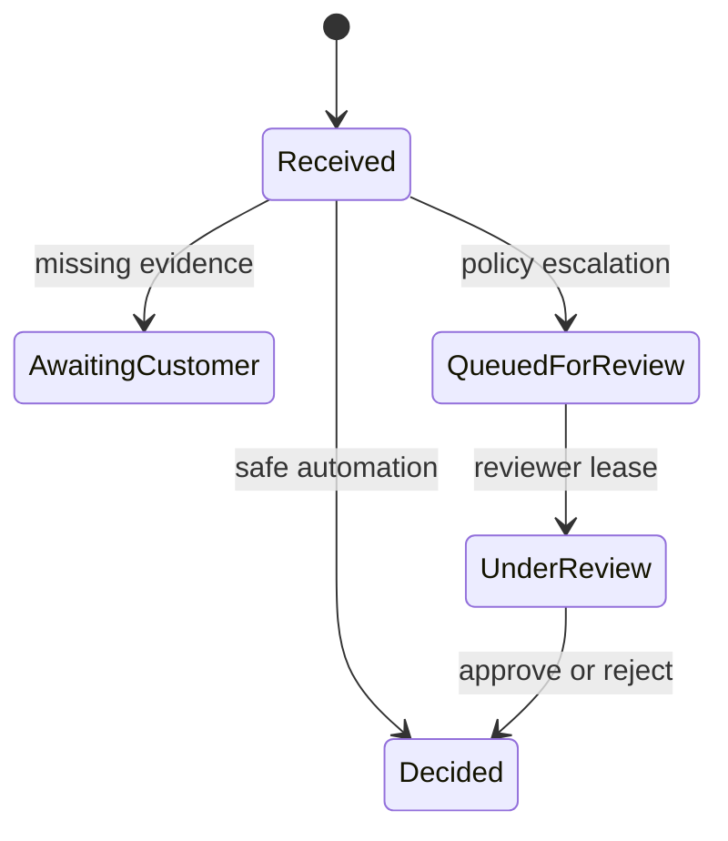

# Human–Agent Service Design Lab

A portfolio lab for designing **human + AI agent collaboration** as a service, not merely as a chatbot screen.

The central question is:

> When should an AI agent act autonomously, when should it ask the customer for more information, and when should it hand control to a human reviewer?

This repository turns that question into explicit policies, measurable workflows, escalation rules, service blueprints and review tooling.

## Why this project exists

Many AI prototypes optimize only for model accuracy. Real services also have to optimize for:

- customer completion rate;
- reviewer workload;
- time to decision;
- automation rate;
- false-positive / false-negative trade-offs;
- evidence quality;
- customer trust and comprehension;
- override rate;
- auditability;
- operational fallback when the model or a downstream service is unavailable.

The project therefore models the **whole interaction system** around an AI decision.

## Reference journey



## Service blueprint

| Layer | Customer-facing | AI / system | Human operations | Measurement |
|---|---|---|---|---|
| Intake | Form / conversational intake | completeness checks | — | abandonment, completion time |
| Evidence | upload / consent | extraction, validation, retrieval | exception handling | missing evidence rate |
| Decision | status + explanation | scoring, policy routing | reviewer decision | automation, override, SLA |
| Follow-up | request more info | next-best-action selection | escalation | rework loops |
| Outcome | final decision | audit event | appeal / QA | accuracy, fairness, trust |

## Core design principles

### 1. Confidence is not authority

A model confidence score does not automatically grant permission to act. The policy layer also considers impact, evidence completeness, explicit compliance rules and customer vulnerability.

### 2. Escalation is a product feature

Human review is not treated as a failure mode. The system represents escalation reasons explicitly so review queues can be prioritized and the product team can learn where automation is weak.

### 3. Explanations are audience-specific

A reviewer needs evidence provenance and policy details. A customer needs a concise, actionable explanation. The system separates these views.

### 4. Every decision is observable

Each workflow produces an audit event containing the agent recommendation, policy route, human override (if any), latency and outcome.

## Repository layout

```text
human-agent-service-design/
├── human_agent/
│   ├── domain.py              # validated case, evidence and recommendation model
│   ├── policy.py              # explicit automation and escalation policy
│   ├── workflow.py            # versioned case lifecycle and review commands
│   ├── review_queue.py        # SLA-aware priority queue and expiring leases
│   ├── audit.py               # append-only hash-chained event ledger
│   └── metrics.py             # operational outcome projections
├── app/api.py                 # FastAPI policy and experiment boundary
├── service_design.py          # compatibility facade for original imports
├── reviewer_cockpit.html      # static portfolio prototype
└── tests/                     # policy, API, lifecycle and concurrency invariants
```

## Operational case lifecycle

The package now models the state around a recommendation rather than stopping at a
stateless routing response:



Every mutation uses an expected case version, preventing a stale reviewer screen from
silently overwriting a newer decision. Human-review items are ordered by policy priority
and SLA deadline, leased to one reviewer for a bounded period, and returned to the queue
when the lease expires. Completed decisions append a hash-chained audit event recording
the actor, rationale, agent override and prior event hash.

These are in-memory reference implementations with explicit production mappings. A real
deployment would persist case versions transactionally, use a shared queue, and write the
audit stream to durable append-only storage.

## Example policies

A case can be routed to a human when any of the following is true:

- confidence is below a configurable threshold;
- financial / customer impact is high;
- evidence is incomplete or contradictory;
- policy requires mandatory review;
- the model and deterministic checks disagree;
- a customer explicitly requests human review;
- the same automated step fails repeatedly.

## Metrics that matter

This lab intentionally reports both AI and service metrics:

- **automation rate** — cases completed without human intervention;
- **review rate** — cases sent to human operations;
- **override rate** — reviewer disagrees with agent recommendation;
- **request-more-info rate** — cases needing an extra customer loop;
- **decision latency** — end-to-end service time;
- **review burden** — weighted queue load;
- **high-impact auto-decision rate** — useful guardrail metric;
- **explanation coverage** — decisions with an actionable customer explanation.

The regression suite also protects operational invariants: stale-version rejection,
reviewer lease ownership, expired-lease recovery, invalid state transitions, evidence
provenance, override attribution and audit-chain verification.

## Run

```bash
python service_design.py
```

The demo uses synthetic cases only. No customer, banking or employer data is included.

## Portfolio signal

This repository is intended to demonstrate the ability to connect:

**Agentic AI · Service Design · Human-in-the-loop · Responsible Automation · Workflow Prototyping · Experiment Metrics · Auditability**
