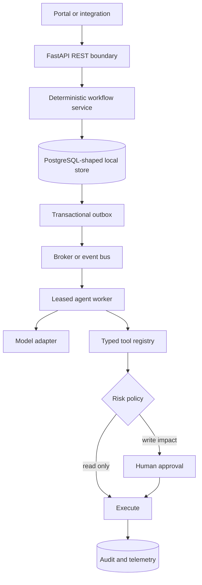
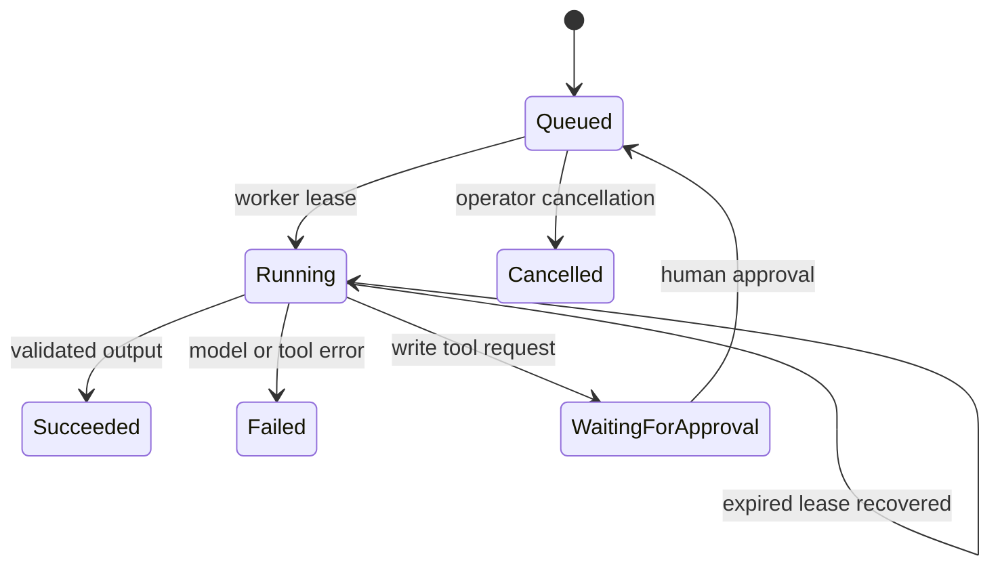

# Agentic Service Desk & Human–Agent Control Plane

A Jira/ITSM-style service backend in which deterministic workflow owns business state and AI agents operate through durable jobs, typed tools, explicit risk policy and human approval.

This is not a collection of agents chatting with one another. It implements the system boundaries an enterprise workflow needs: projects, human-readable issue keys, immutable workflow definitions, role-authorized transitions, optimistic concurrency, idempotent requests, transactional outbox, leased agent jobs, bounded SQL access, approval-gated write tools, audit history and service metrics.

The original human–agent routing lab remains in `human_agent/`. The production-oriented service desk is in `service_desk/`; both are exercised by the same API, package and CI pipeline.

## Design thesis

AI confidence is not authority. The model may classify, summarize, retrieve evidence or recommend an action. The workflow engine decides whether that action is legal; the tool policy decides whether it is permitted; a human approves high-impact effects.



## Implemented capabilities

### Jira-style issue domain

- project keys and atomic sequential issue keys such as `OPS-1`;
- versioned workflow definitions with explicit transition rules;
- `open → triaged → in_progress → waiting_for_customer → resolved → closed` lifecycle;
- requester, service-agent, admin and AI-worker roles;
- resolution requirements and invalid-transition rejection;
- optimistic issue versions that reject stale browser or agent writes;
- public and internal comments with visibility policy;
- assignment, labels, priority and complete actor-attributed audit history.
- same-project parent/child hierarchy with single-parent and cycle prevention; typed blocks/relates links;
- per-project, per-priority first-response and resolution SLAs, with customer-wait pauses.
- parameterized JQL-like search with allowlisted fields and stable keyset pagination.

### Safe issue search

`GET /v1/projects/{project_id}/search` accepts a deliberately bounded query language. Supported fields are `status`, `priority`, `assignee`, `reporter`, `label`, `text` and `sla`; clauses may be joined with `AND`. Status and priority support `IN`, text uses `~`, and SLA supports `breached`, `at_risk`, `on_track` or `none`.

```text
priority IN (high,critical) AND label = production AND sla = at_risk
status != closed AND assignee = agent-4 AND text ~ "authentication"
```

The parser never places user input in SQL syntax: it maps allowlisted fields to fixed SQL fragments and sends values as bound parameters. Unknown fields/operators, `OR`, semicolons and malformed cursors are rejected. Pagination uses an opaque cursor containing the compound `(updated_at, issue_sequence)` position, preventing skips when multiple issues share a timestamp. This is intentionally a useful subset, not a claim of Jira JQL compatibility.

### Kafka event path

Issue writes, audit and outbox insertion share one SQLite transaction. `service-desk-stream publish` leases outbox rows, publishes keyed by issue ID to preserve per-issue partition order, waits for broker acknowledgement (`acks=all` and idempotent Kafka producer), then acknowledges the outbox row. Broker failure schedules a retry. `service-desk-stream consume` applies events to an inbox-backed issue-event projection, then commits the Kafka offset synchronously. The event envelope has a schema version, stable event ID, aggregate ID, type, payload and timestamp.

```bash
pip install -e '.[kafka]'
docker compose -f compose.kafka.yml up -d --wait
service-desk-stream publish --database service-desk.db --once
service-desk-stream consume --database service-desk.db --once
```

Create an issue through the REST API before publishing; keep publisher and consumer running without `--once` for continuous processing. The example broker binds to localhost only. `--once` on the consumer polls once and may return before a message arrives; use continuous mode for a demo. The projection counts event types per issue; inspect `issue_event_counts` with SQLite. A fresh consumer group begins at the earliest offset.

Delivery is **at least once**, not exactly once: a crash after Kafka acknowledgement but before outbox acknowledgement can republish an event. The inbox primary key makes projection effects idempotent, and its insert and counter increment share a database transaction. A malformed event prevents offset commit and requires an operational poison-message policy/DLQ in a real deployment. Schema migration, authentication/TLS, broker provisioning and multi-tenant isolation remain deployment work. Docker and a live broker are required for a full integration run; unit tests cover the acknowledgement/retry/replay/offset contract without pretending to exercise a broker.

### Durable agent orchestration

Agent work is represented as persisted jobs rather than an in-memory chain:



Every job records capability, input, output, error, attempt count, retry budget, lease owner and expiry. A crashed worker cannot strand the job permanently: an expired lease is claimable by another worker. Only the current lease owner may complete a running job.

The runnable deterministic model is an offline test double, not a fake claim of LLM quality. A production OpenAI, Azure OpenAI or local model adapter can implement the same `AgentModel` protocol without changing workflow or persistence code.

### Governed tools

Tool risk is assigned by a server-side allowlist. The agent cannot label `transition_issue` as read-only to bypass approval.

| Tool | Risk | Execution rule |
|---|---|---|
| `knowledge_search` | Read only | Execute under the active job lease |
| `service_desk_sql` | Read only | SELECT/WITH only, table allowlist, row bound, read-only DB connection |
| `assign_issue` | Reversible write | Human approval required |
| `transition_issue` | High impact | Independent human approval required |

High-impact calls enter `waiting_for_approval`; the requesting worker loses its lease. The same actor cannot request and approve the call. Approval requeues the durable job instead of executing an untracked side effect inside an HTTP request.

### Safe SQL tool

The SQL tool demonstrates the boundary interviewers usually mean when asking whether an agent can “go to SQL”:

- accepts one `SELECT` or `WITH` statement;
- rejects mutation, DDL, PRAGMA, attach and multi-statement input;
- allows only configured read-model tables;
- uses named parameters;
- opens SQLite in `mode=ro` and enables `query_only`;
- caps returned rows and reports truncation;
- associates output with the originating durable job.

This lightweight validator is appropriate for a local reference adapter. Production should parse SQL into an AST using the target dialect, query a read replica with a dedicated least-privilege identity, enforce execution timeout/cost limits and log query fingerprints.

## Transaction boundaries

Issue creation performs all of the following in one database transaction:

1. lock the project sequence;
2. validate or replay the idempotency key;
3. allocate the human-readable issue key;
4. persist the issue;
5. persist the audit event;
6. persist the outbox event.

The broker is never called inside this transaction. A dispatcher leases committed outbox rows, publishes them and acknowledges each lease. Failure increments attempts and schedules a delayed retry. This prevents the classic state where the API commits `OPS-42` but crashes before the agent/notification event is sent.

SQLite uses `BEGIN IMMEDIATE` for the runnable local adapter. PostgreSQL would use a row lock or atomic `UPDATE … RETURNING` for issue sequences and `FOR UPDATE SKIP LOCKED` for outbox/job claiming.

## REST API

Run locally:

```bash
pip install -e '.[dev]'
uvicorn app.api:app --reload
```

Create a project:

```bash
curl -X POST http://localhost:8000/v1/projects \
  -H 'content-type: application/json' \
  -d '{"key":"OPS","name":"AI Operations"}'
```

Create an idempotent issue:

```bash
curl -X POST http://localhost:8000/v1/issues \
  -H 'content-type: application/json' \
  -H 'x-actor-id: requester-17' \
  -H 'x-actor-role: requester' \
  -H 'idempotency-key: mobile-request-8841' \
  -d '{
    "project_id":"PROJECT_ID",
    "summary":"Production VPN unavailable",
    "description":"Authentication fails for the engineering group.",
    "priority":"high",
    "labels":["vpn","production"]
  }'
```

Transition with optimistic concurrency:

```bash
curl -X POST http://localhost:8000/v1/issues/ISSUE_ID/transitions \
  -H 'content-type: application/json' \
  -H 'x-actor-id: triage-worker-1' \
  -H 'x-actor-role: ai_worker' \
  -d '{"name":"triage","expected_version":1}'
```

Request durable AI work:

```bash
curl -X POST http://localhost:8000/v1/issues/ISSUE_ID/agent-jobs \
  -H 'content-type: application/json' \
  -H 'x-actor-id: agent-4' \
  -H 'x-actor-role: agent' \
  -d '{
    "capability":"retrieve_knowledge",
    "input_payload":{"query":"VPN authentication outage runbook"},
    "max_attempts":3
  }'
```

The API also exposes assignment, public/internal comments, filtered issue lists, audit streams and tool approval. Typed domain failures map to explicit `403`, `404`, `409` or `422` responses.

## Human–agent routing lab

The original service-design layer models customer evidence, agent recommendations and policy routing:

- automate low-impact, high-confidence, well-evidenced cases;
- ask the customer when evidence is incomplete;
- queue uncertain/high-impact cases for a reviewer;
- lease cases by priority and SLA deadline;
- record reviewer overrides in a hash-chained audit ledger;
- project automation, review, override and explanation metrics.

`reviewer_cockpit.html` provides the corresponding reviewer UI prototype. It is deliberately separate from the service-desk backend so the human decision journey and backend control plane can be inspected independently.

## Verification

```bash
ruff check .
ruff format --check .
pytest -q
service-desk-evidence > service-desk-run.json
docker build -t agentic-service-desk .
```

The regression suite covers:

- idempotent create and conflicting replay;
- workflow authorization and required resolution;
- stale-version rejection;
- issue-key allocation and label normalization;
- public/internal comment visibility;
- issue + audit + outbox atomicity;
- outbox lease, retry and acknowledgement;
- publish failure, post-publish crash/replay, idempotent inbox and offset ordering;
- hierarchy cycles, second-parent rejection, SLA pause/resume and breach observations;
- query allowlisting, injection-shaped rejection, operational SLA filters and keyset pagination;
- job lease ownership and expired-lease recovery;
- deterministic triage and evidence retrieval;
- SQL mutation, table and multi-statement rejection;
- server-owned tool risk and independent approval;
- REST lifecycle behavior;
- the earlier human-review lifecycle and operational policy metrics.

CI has three boundaries: lint/test/evidence, wheel installation outside the source tree, and a multi-stage non-root container with a live health probe. The JSON evidence artifact executes a real issue lifecycle, agent job, SQL read, audit stream and outbox drain; its invariant flags are computed from the run.

## Repository layout

```text
service_desk/
├── agent.py       leased worker and replaceable model protocol
├── api.py         Jira-style REST resources
├── errors.py      typed service failures
├── evidence.py    deterministic end-to-end artifact
├── models.py      issue, workflow, job and tool contracts
├── repository.py SQLite transactions, outbox and leases
├── service.py     authorization and application policy
├── search.py      bounded JQL-like compiler and keyset cursor
├── streaming.py   Kafka publisher, outbox dispatcher and idempotent projection
├── stream_worker.py  publisher/consumer CLI
└── tools.py       registry, bounded SQL and knowledge tools
human_agent/
├── audit.py       hash-chained decision ledger
├── domain.py      evidence and recommendation model
├── metrics.py     service outcome projections
├── policy.py      automation/escalation rules
├── review_queue.py
└── workflow.py    human review lifecycle
app/api.py         combined FastAPI application
reviewer_cockpit.html
tests/
```

## Honest production boundary

The local implementation proves workflow and failure semantics on SQLite and has an optional Kafka-compatible broker adapter; CI does not start a real Kafka broker. It does not claim distributed exactly-once delivery. A production deployment would use PostgreSQL, Redis where caching is justified, object storage for attachments, OpenSearch for issue search, OIDC for identity, OpenTelemetry for traces, per-tenant encryption/access control and a workflow runtime such as Temporal when processes extend across long waits.

The core design survives those replacements because business state, asynchronous delivery, agent execution and tool authority already have separate contracts.

## Interview surface

`FastAPI` · `REST` · `SQL` · `Kafka` · `outbox/inbox` · `at-least-once delivery` · `SLA` · `issue hierarchy` · `workflow state machines` · `RBAC` · `optimistic concurrency` · `idempotency` · `leases` · `agent orchestration` · `tool calling` · `human approval` · `auditability`
